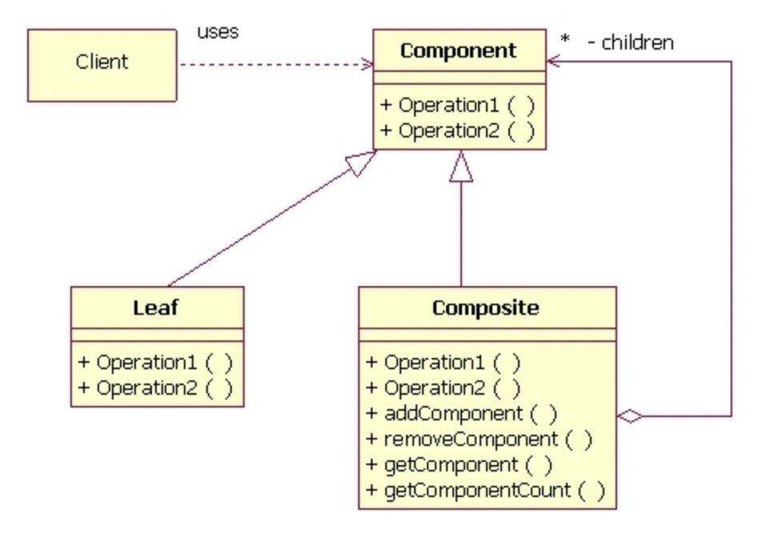

# Composite Design Pattern

The Composite Design Pattern is a **Structural Design Pattern** that facilitates the composition of objects into a tree-like structure. It enables the client code to treat individual objects and compositions of objects uniformly. This pattern provides a unified interface for both leaves (individual objects) and composites (structures composed of objects), simplifying the client code.

## Conceptual Example

### 1. Composite Pattern in Operating System's File System

Let’s try to understand the Composite pattern with an example of an operating system’s file system. In the file system, there are two types of objects: files and folders. There are cases when files and folders should be treated in the same way. This is where the Composite pattern comes in handy.

Imagine that you need to run a search for a particular keyword in your file system. This search operation applies to both files and folders. For a file, it will just look into the contents of the file and for a folder, it will go through all files of that folder to find that keyword.

### 2. Composite Pattern in an Ordering System

Imagine your application is like a tree, with Products and Boxes as its branches. A Box can hold Products or even smaller Boxes, creating a tree-like structure. Now, think about building an ordering system where an Order includes individual products or Boxes filled with products or nested Boxes. Calculating the total price directly becomes tricky. You'd need to unwrap all nested Boxes, go through Products and Boxes, and handle various class structures.

Here's where the Composite pattern comes to the rescue. It suggests dealing with Products and Boxes through a common interface, using a method to calculate the total price. This method smoothly works by returning the price for a Product and, for a Box, recursively going through each item to add up the costs. This recursive approach ensures that no matter how deep the nesting goes, the total price is accurately calculated. Plus, Boxes can add extra costs like packaging expenses, making the application more adaptable and scalable. In simpler terms, the Composite pattern helps handle complex structures in your app, making it easier to calculate total prices in a flexible and efficient way.

## Composite Design Pattern UML Diagram

This UML diagram illustrates the Composite pattern's class hierarchy, demonstrating relationships between key elements.

1. **Component:** The Component interface describes operations that are common to both simple and complex elements of the tree.

2. **Leaf:** The Leaf is a basic element of a tree that doesn't have sub-elements. Usually, leaf components end up doing most of the real work, since they don’t have anyone to delegate the work to.

3. **Composite:** A Container, also known as a composite, is like a box that holds other things inside, which can be either individual items (leaves) or more boxes (other containers). The interesting part is, the container doesn't really know exactly what's inside it, it treats everything the same way using a common interface. Upon receiving a request, a container delegates the work to its sub-elements, processes intermediate results and then returns the final result to the client.

4. **Client:** The Client works with all elements through the component interface. As a result, the client can work in the same way with both simple or complex elements of the tree.

## Problem It Solves

The Composite pattern addresses the following problems:

1. **Unified Treatment of Individual and Composite Objects for Reduced Client Code Complexity:** Without the Composite pattern, treating individual and composite objects differently in client code can be challenging. This will lead to complicated client code when processing a complex tree-like structure. This pattern enables the client to interact uniformly with both types (Leaf and Composite Objects) through a common interface.

2. **Enables Open/Closed Principle:** We can introduce new element types (leaf types) into the app without breaking the existing code, which now works with the object tree.

## Use Case

1. **Hierarchical Structures:** The Composite pattern provides you with two basic element types that share a common interface: simple leaves and complex containers. A container can be composed of both leaves and other containers. This lets you construct a nested recursive object structure that resembles a tree.

2. **You Want to Treat Objects Uniformly:** All elements defined by the Composite pattern share a common interface. Using this interface, the client doesn't have to worry about the concrete class of the objects it works with.

3. **Operations on the Whole Structure:** You need to perform operations on the entire structure, and you want these operations to be applicable to both individual objects and compositions.

## References

1. [Refactoring Guru - Composite Design Pattern](https://refactoring.guru/design-patterns/composite)
2. [Composite Design Pattern Video Explanation](https://www.youtube.com/watch?v=FLkCkUY7Wu0)
